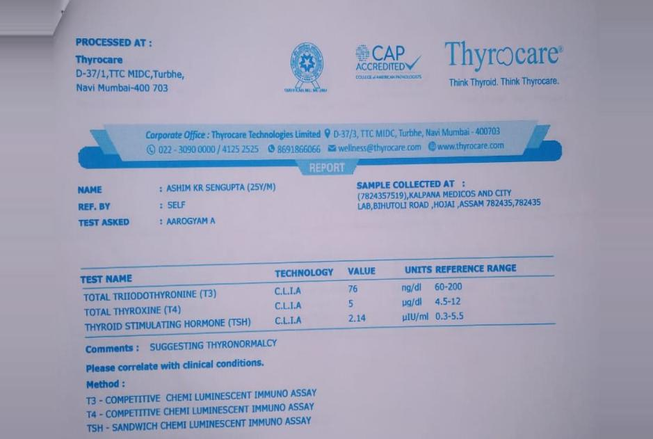
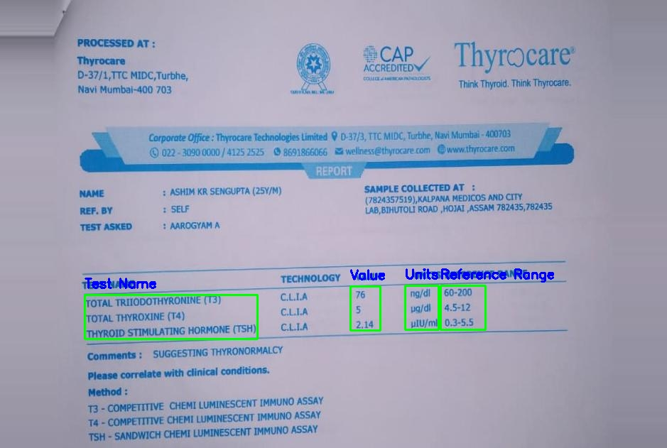
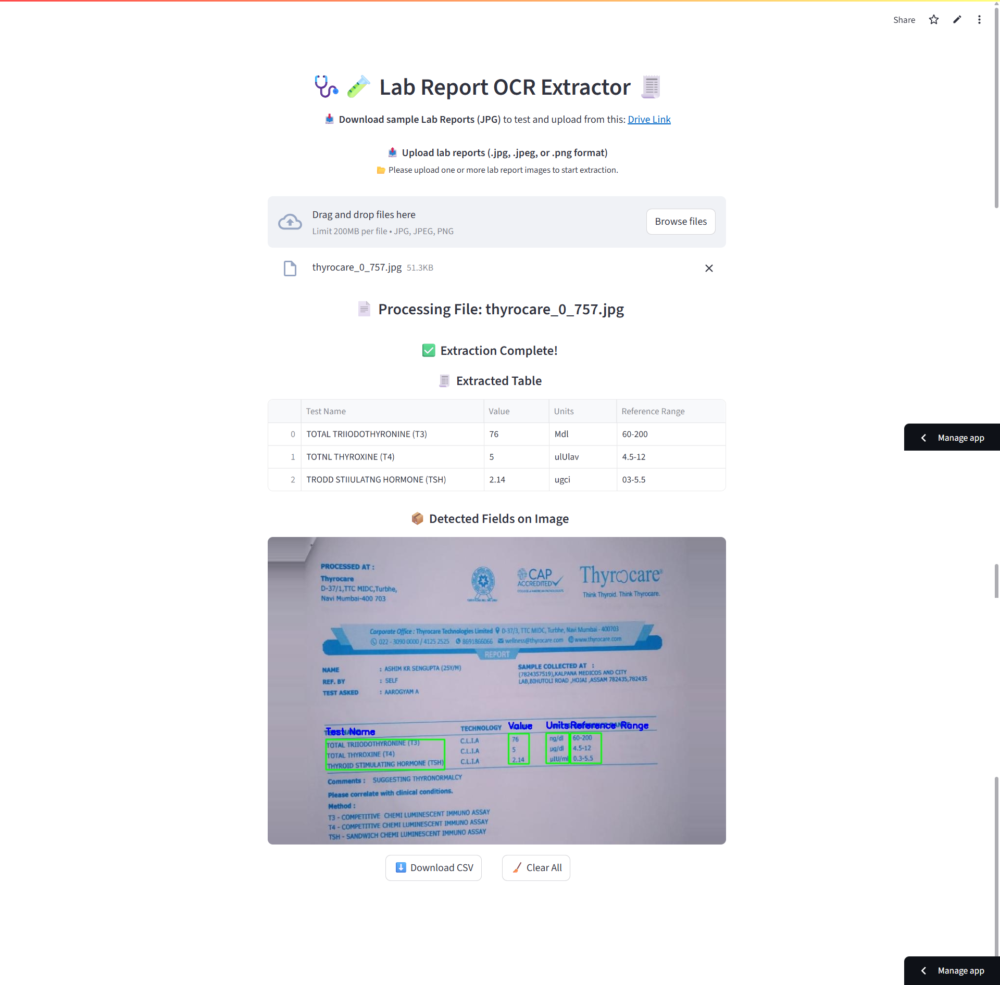

# 🩺 Custom Object Character Recognition (OCR) on Google Drive

<p align="center">
  
  
  
  
  
  
  
  
  
  
  
</p>

#

Welcome to my **Medical Lab Report OCR Project**! 🧪

This project tackles a very specific problem in medical documentation: extracting structured data like **Test Names**, **Values**, **Units**, and **Reference Ranges** from unstructured lab report images.

Manually entering such data is slow, repetitive, and error-prone. So I designed an intelligent solution combining object detection (YOLOv3) with OCR (Tesseract/EasyOCR) to automate this workflow. 🧠🖼️

This is not just a proof of concept — it's a fully working pipeline with model training, preprocessing, post-processing, UI deployment, and CSV export.

- > 🔗 Try the app: [🌐 Streamlit Live](https://custom-ocr-with-yolo-on-drive-debasis-baidya.streamlit.app/)
- > 🎬 Watch Demo: [📽 YouTube Video](https://your-demo-video-link)


---

## 🎯 Objective

Build an end-to-end system to:

* 🎯 **Detect**: Identify specific regions in lab reports using YOLOv3
* 📸 **Preprocess**: Clean and prepare those image snippets
* 🧾 **Extract**: Use Tesseract/EasyOCR to pull out actual text from regions
* 🧠 **Structure**: Organize results into a tabular format
* 📤 **Export**: Save as downloadable CSV for use in Excel or EMR systems
* 💻 **Deploy**: Provide a UI via Streamlit so others can test it easily

---

## 🧠 Problem Background

In real-world clinics and diagnostic labs, lab reports are often scanned or saved as JPGs with varied formats. Extracting key medical parameters is essential but mostly done manually.

This project solves that by:

* 🔍 Detecting predefined regions using a trained YOLOv3 model
* 🧾 Reading those regions via OCR (Tesseract/EasyOCR)
* 📊 Structuring the extracted text for automated storage and analysis

---

## 📂 Approach Overview

The pipeline follows these logical steps:

1. 📌 **Image Labeling** – using `LabelImg` for bounding boxes
2. 📁 **Annotation Conversion** – XML to YOLO txt via custom Python script
3. 🧠 **YOLOv3 Training** – on Google Colab (GPU enabled)
4. 🔄 **Model Export** – save best weights to ONNX
5. 🔍 **Detection + Preprocessing** – load model, preprocess with OpenCV
6. 🧾 **Text Recognition** – via EasyOCR or Pytesseract
7. 🧠 **Smart Postprocessing** – e.g., merging multi-word test names
8. 📤 **CSV + Annotated Image Output**
9. 🌐 **Deployment** – Streamlit-based web interface
10. 🎥 **Documentation + Demo** – screenshots, videos for review

---

## 🔧 Features Implemented

* ✅ YOLOv3-based detection (ONNX)
* ✅ Custom image preprocessing: resize, grayscale, blur, threshold
* ✅ OCR with fallback: EasyOCR or Pytesseract
* ✅ Smart merge logic for split fields
* ✅ Streamlit UI with image upload, download buttons
* ✅ Annotated image preview + CSV export

---

## 📁 File Structure

```
📂 project_root
├── 📒 P10.ipynb                # Notebook for model training & XML parsing
├── 📄 Apps.py                 # Streamlit app for UI
├── 🧾 data.yaml              # YOLO label map config
├── 🧠 model/best.onnx        # Trained YOLO model (ONNX format)
├── 📷 data_images/           # Labeled input images
├── 📄 Extract Text from XML.ipynb  # Converts XML → YOLO format
├── 📸 screenshots/            # Add your screenshots here
└── 📄 Instructions.pdf        # Project outline
```

---

## 📊 Results

* 📌 **Accuracy**: High mAP\@0.5 for bounding box detection
* 🧠 **OCR Success Rate**: Robust across different font sizes/styles
* 🔄 **Smart Field Merging**: e.g., joins "Total" + "Bilirubin"
* 📈 **Usability**: Streamlit UI makes it plug-and-play for any JPG report

---

## 🖼️ Streamlit Interface (UI Preview)

| Input Image                     | YOLO Detection                     | OCR Output                        |
| ------------------------------- | ---------------------------------- | --------------------------------- |
|  |  |  |

> 📦 Exports: `ocr_result.csv`, `annotated_image.jpg`

---

## 💡 What I Did — Full Technical Walkthrough

### 🧷 1. Image Labeling

```bash
🖼️ Labeled the report images using LabelImg  
🏷️ Saved bounding boxes for 4 classes: Test Name, Value, Units, Reference Range  
💾 Output saved in Pascal VOC (XML) format
```

---

### 📤 2. Convert Annotations (XML → YOLO txt)

```python
📂 Used Extract_Text_from_XML.ipynb to parse XML files  
🧾 Extracted filenames, dimensions, and bounding boxes  
📐 Normalized coordinates and encoded labels for YOLOv5 format  
📝 Saved them as .txt files (YOLO format)
```

---

### ⚙️ 3. Model Training on Google Colab (GPU)

```bash
💾 Mounted Google Drive
from google.colab import drive
drive.mount('/content/drive')

🧬 Cloned YOLOv5 repo and installed dependencies
!git clone https://github.com/ultralytics/yolov5.git
%cd yolov5
!pip install -r requirements.txt

🚀 Trained YOLOv5 model with custom dataset
!python train.py --data data.yaml --weights runs/train/Model2/weights/best.pt --img 640 --batch-size 2 --name Model --epochs 200
```

✅ Training was done on **Google Colab (GPU runtime)** for speed and convenience.

---

### 🧠 4. Export Model to ONNX

```bash
📤 Exported best weights to ONNX format for OpenCV inference
# ✅ Set path to your trained weights
best_pt_path = "/content/drive/MyDrive/CustomOCR/yolov5/runs/train/Model5/weights/best.pt"

# ✅ Changed directory to yolov5 before running export
%cd /content/drive/MyDrive/CustomOCR/yolov5

# ✅ Run export to generate ONNX model in same folder as best.pt
!python export.py --weights {best_pt_path} --include onnx --simplify --opset 12

# ✅ Moved ONNX model to /models/
!mv runs/train/Model5/weights/best.onnx /content/drive/MyDrive/CustomOCR/models/best.onnx
```

---

### 🔍 5. Inference + Preprocessing (OpenCV DNN)

```python
🧠 Used Apps.py and main.py for ONNX inference  
📏 Resized input image to 640x640  
📐 Applied padding to maintain aspect ratio  
🧱 Created blob with OpenCV and ran model  
✂️ Applied NMS to filter overlapping detections
```

---

### 🧾 6. OCR with Tesseract/EasyOCR

```python
🔍 Cropped detected boxes  
🖤 Applied preprocessing:
    - Grayscale  
    - Gaussian Blur  
    - Threshold + Invert  

🧠 Used EasyOCR (or PyTesseract) to extract text for each box
```

---

### 📊 7. Post-Processing

```python
🔤 Merged fragmented test names (e.g., "Total" + "Cholesterol")  
🧾 Combined outputs into a structured pandas DataFrame  
📥 Provided download button for CSV
```

---

### 🌐 8. Streamlit UI Deployment

```bash
📤 Upload JPG file  
📦 YOLOv5 ONNX model detects fields  
🔠 OCR extracts the text  
📊 Results shown in table format  
🖼️ Annotated image + 📄 CSV available to download  
▶️ streamlit run Apps.py
```

---

## 🖼️ Streamlit UI Screenshot

<p align="center">
  
</p>

---

## 🙋‍♂️ About Me

Hi, I’m **Debasis Baidya** from Kolkata 👋
With **11+ years** of experience in the MIS domain, I am now transitioning into the world of **Data Science**.

* Currently Working as Senior MIS Analyst | Data Science Intern

✅ 80%+ automation of manual processes at my workplace
📊 Skilled in Power BI, Python, SQL, ML, DL, NLP, Google Apps Script, Google Site

<p align="left">
  📢 <strong>Connect with me:</strong>&nbsp;

  <a href="https://www.linkedin.com/in/debasisbaidya">
    
  </a>

  <a href="mailto:speak2debasis@gmail.com">
    
  </a>

  <a href="https://api.whatsapp.com/send?phone=918013316086&text=Hi%20Debasis!">
    
  </a>
</p>


---

> 🚀 This project shows how machine learning, OCR, and a clean UI can turn static lab reports into structured, digital, and actionable data. Ideal for EMRs, diagnostic apps, and healthcare analytics. 🏥

